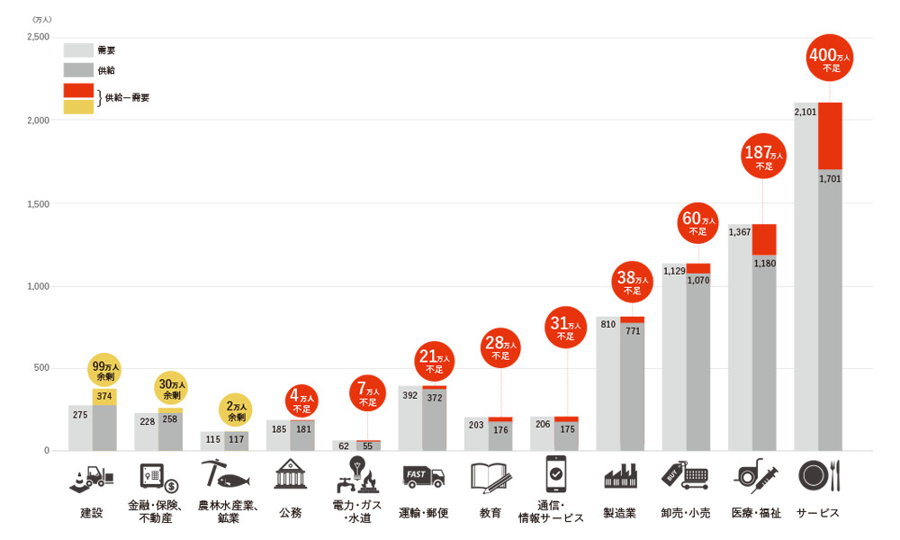

<!--
class: title
-->

# REAL experience of becoming IT Engineer

#### What are the advantages and disadavantages to work in Japan as overseas IT engineer

---

<!--
class: slides
paginate: true
-->

# Hi,Selamat malam!
## Kazuki Hirata

- Embedded software developer 
  / Project Manager Japan

- IT lecturer 
  (web, IoT, AI, Business Etiquette) Thailand  Vietnam 
- Web system Product manager 
  / Project Manager Vietnam 

---
<!-- _class: index -->
# Table of Contents
 

  1. Why work abroad?
  2. Working as an IT Engineer in Japan
  3. Salary Comparison
  4. Differences between IT Engineers in Japan, Vietnam
  5. Conclusion

---
<!-- Why work abroad? -->
<!--
class: title
-->
# Why Work Abroad?
---
<!--
class: slides
paginate: true
-->
### Benefits of Working Abroad
 

- Personal growth by experiencing a [new culture]() and stepping outside of our comfort zone
- Opportunity to [improve language skills]()
- Chance to expand network and gain experience in a different market

---
<!--
class: title
paginate: false
-->
# Working as an IT Engineer in Japan

---
<!--
class: slides
paginate: true
-->

### The current IT industry in Japan

 

- Japan’s [ICT market is the third-largest]() in the world after the U.S. and China, with a 6.4% share of the global market.

- Japan has [innovative IT businesses and startups]() in various fields
- Japanese government supports IT businesses and startups to go global and [cooperate with other countries]()

---
###  The current IT industry in Japan

## IT industry in Japan is short 310,000 employees in 2030.

---
<!--
class: slides
paginate: true
-->
### Benefits of working as an IT Engineer in Japan

 

- Access to [leading technology]() companies and [cutting-edge]() projects
- [Improve the skills]() to develop high quality products
- Excellent [internal training]()

---
<!--
class: slides
paginate: true
-->
###  Challenges of working as an IT Engineer in Japan
#### Language barrier

 

- Many Japanese companies require a [certain level of Japanese language]() proficiency.
- Learning Japanese can be a long and difficult process.
- However, many companies offer [language training programs]() for their employees.

---
### Challenges of working as an IT Engineer in Japan
#### Cultural differences

 

- Japanese work culture is often characterized by [long working hours, strict hierarchy, and group harmony]().
- This can be challenging for some overseas IT Engineers who are used to a more flexible work environment.

---
<!--
class: title
paginate: false
-->
# Salary Comparison

---
<!--
class: slides
paginate: true
-->
### Salary comparison and living cost between IT Engineers in Japan and other countries

|  | Japan | Vietnam | indonesia | Singapore |
| ----------- | ----------- | ----------- | ----------- | ----------- |
| Salary | 68,000 | 19,000 | 17,000 | 67,000 |
| Living cost | 12,000 | 3,600 | 4,500 | 21,600 |

##### USD / Year

---
<!--
class: title
paginate: false
-->

# Differences between IT Engineers in Japan, Vietnam

---
<!--
class: slides
paginate: true
-->
### Working culture

#### Japan:
  - Strong work ethic
  - Overtime work is common
  - Punctuality is highly valued
#### Vietnam:
  - More relaxed work culture
  - Flexible working hours
  - Focus on teamwork and collaboration

---
<!--
class: slides
paginate: true
-->
### Management style

#### Japan:
- Top-down hierarchy
- Emphasis on respect for authority
 - Decision-making can be slow

#### Vietnam:
  
  - More collaborative management style
  - Emphasis on building personal relationships
  - Decision-making can be faster than in Japan

---
<!--
class: slides
paginate: true
-->
### Work-life balance

#### Japan:
  - Work-life balance is not emphasized as much as in some other countries
  - Overtime work is common
  - However, some companies are starting to offer more flexible work arrangements
#### Vietnam:
  - Generally good work-life balance
  - Flexible working hours
  - Focus on personal time and family

---
<!--
class: title
paginate: false
-->
# Conclusion
---
<!--
class: slides
paginate: true
-->
### Advantages and disadvantages of working in Japan
#### Advantages

1. Opportunities to work for leading IT companies 
   
2. Access to advanced technology
   
3. High salary and excellent benefits
   
4. Excellent in-house training 

---
<!--
class: slides
paginate: true
-->
### Advantages and disadvantages of working in Japan
#### Disadvantages

1. Language barrier
  
2. Cultural differences
   
3. Work-life balance
   

---
<!--
class: slides
paginate: true
-->
### Final thoughts and recommendations

 

- Working as an overseas IT Engineer in Japan can be both rewarding and challenging
- Learning Japanese language and culture can be helpful in adapting to the work environment
- Consider factors such as salary, work-life balance, and personal goals when making a decision about working in Japan

---
<!--
class: title
paginate: false
-->
# Thank you for paying 
# your attention.